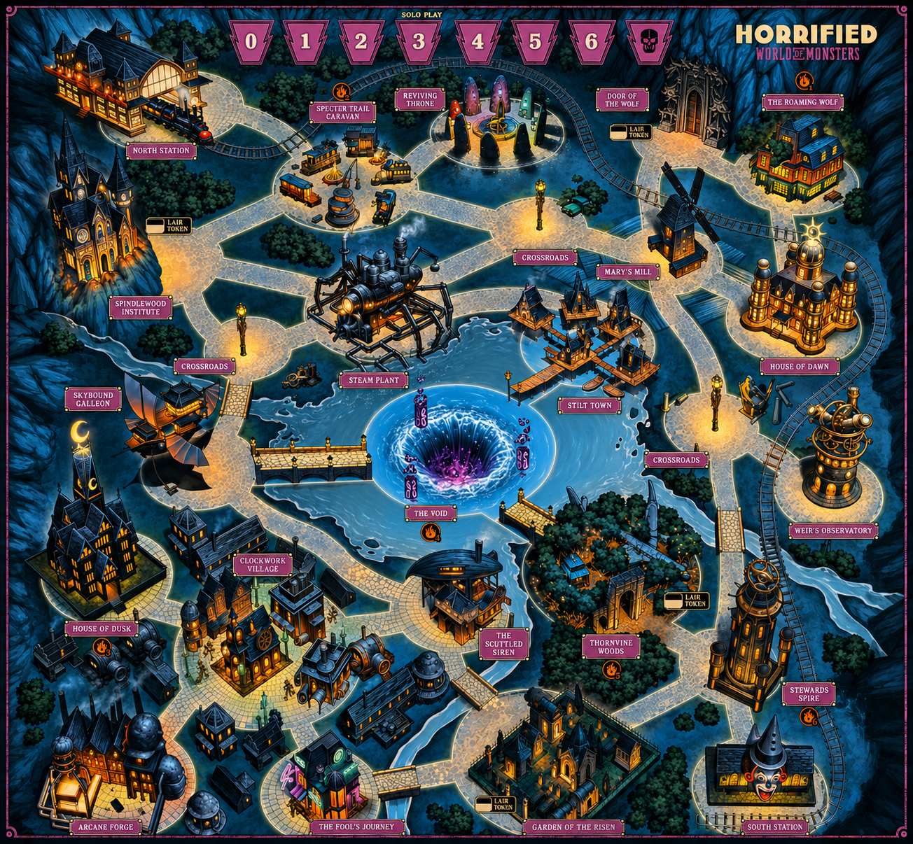
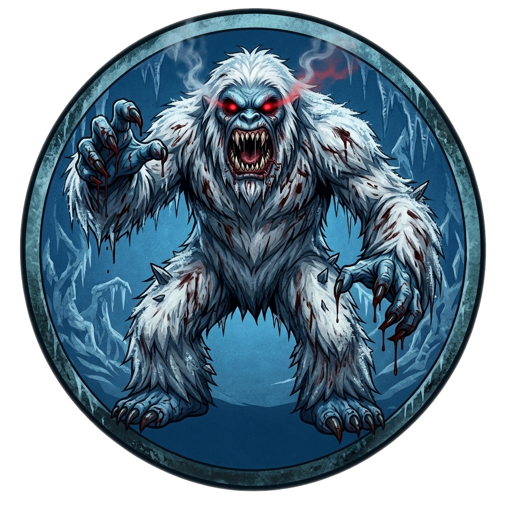
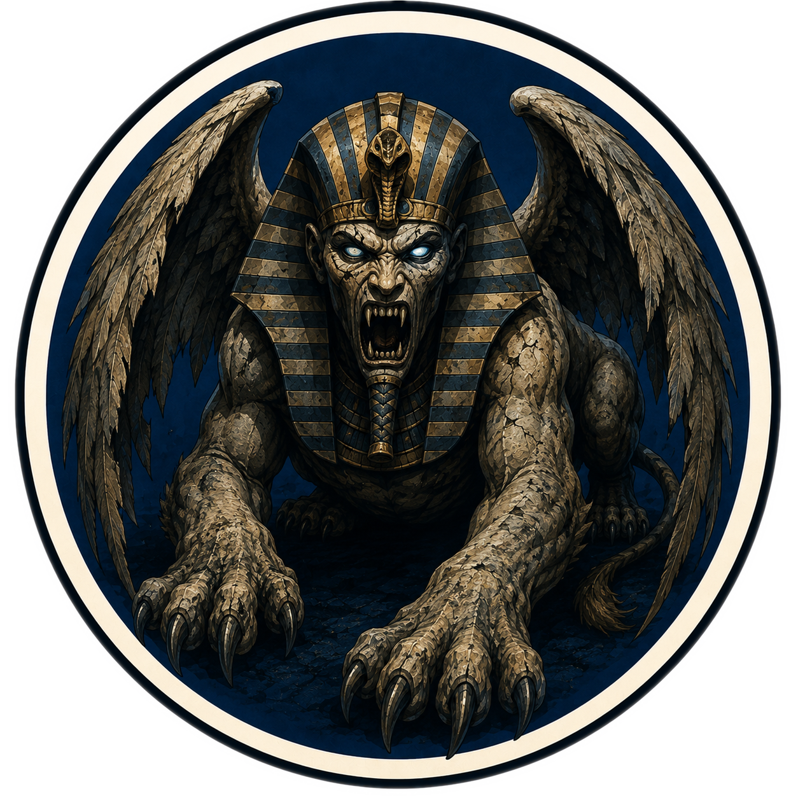
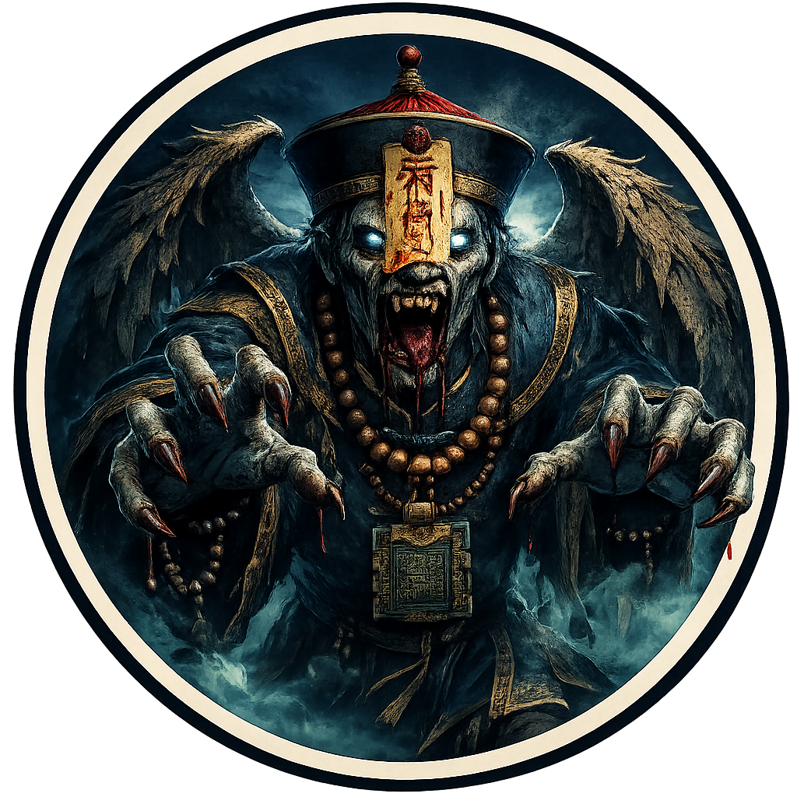
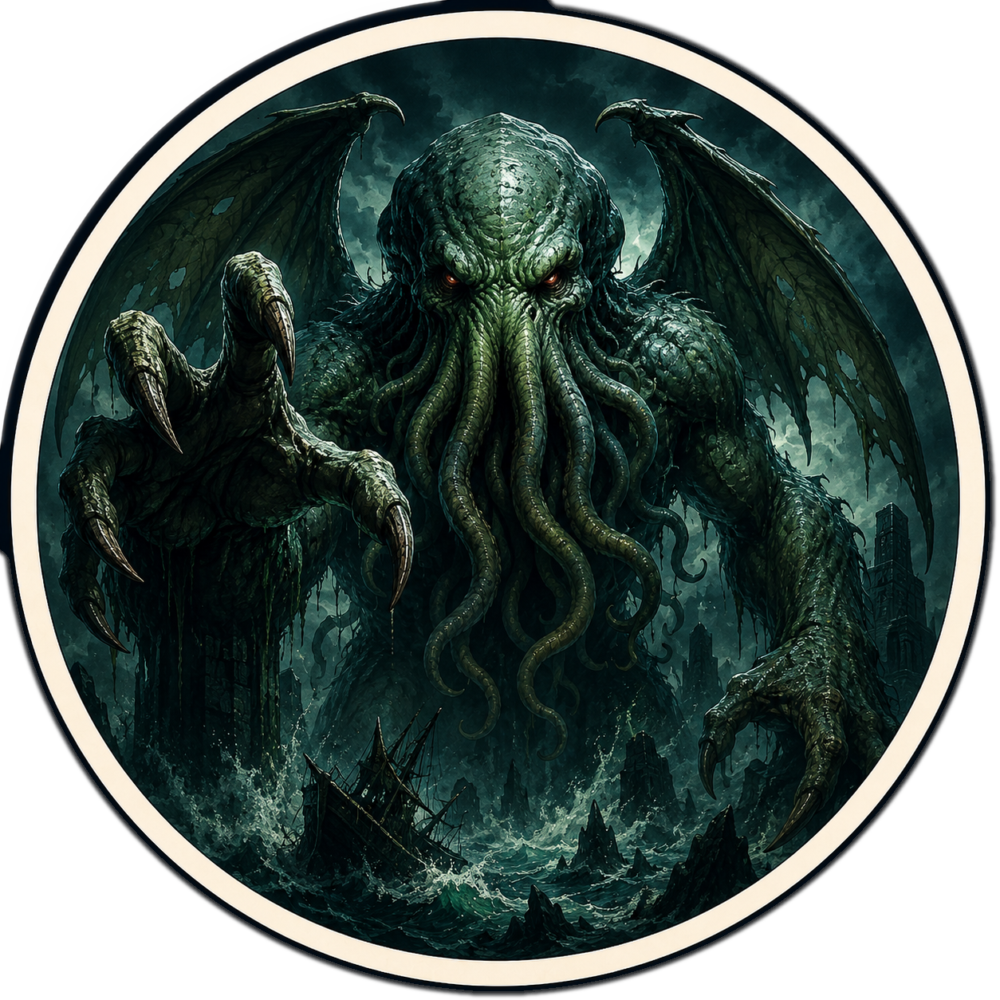

<p align="center">
  
</p>

<h1 align="center">Horrified: World of Monsters — Online</h1>

<p align="center">
  A web-based multiplayer digital implementation of the board game <strong>Horrified</strong>,
  built for zero-install online play with friends — just open a link and go.
</p>

<p align="center">
  
  
  
</p>

---

## 🌟 Key Features

* **Fully Server-Authoritative** — a Python/FastAPI game server owns all rules and state; every client is a thin render layer that re-renders from the server's snapshot after each action, keeping every player's screen perfectly in sync.
* **Two Playable Maps** — the original **World of Monsters** board (Yeti, Sphinx, Jiangshi, Cthulhu) and a **Greek Monsters** expansion board (Siren, plus guest appearances from Basilisk, Cerberus, Chimera, Medusa, and Minotaur), switchable from the lobby.
* **12 Heroes, 30 Monster Cards, 10 Perks** — the full card-driven Monster Deck and Perk Deck (each perk duplicated to 20 physical cards, exactly like the tabletop version), all resolved server-side.
* **On-Map, No-Popup Interactions** — Move, Guide, and every Perk that targets a Hero or Monster resolve by clicking glowing tokens directly on the board, instead of dropdown menus or `prompt()` dialogs.
* **Interactive Full-Screen SVG Board** — click-to-move locations, zoom & pan, and detail modals for every location, hero, monster, and item.
* **Real-Time Visual Feedback** — dice-roll markers pop up right where an attack happens, monster Powers get toast notifications, and a prominent turn banner makes it obvious whose turn it is and how many actions they have left.
* **Procedural Ambient Soundtrack** — spooky background music synthesized live via the Web Audio API, no audio files required.
* **Live Remote Animations** — item pickups, card draws, and Perk plays animate in real time for every connected player, not just the one who triggered them.
* **Live Layout Calibrator** — press `D` in-game (or use the standalone `static/editor.html`) to drag/resize map hitboxes and persist the new coordinates on the fly.

---

## 🖼️ Gallery

<table>
<tr>
<td width="50%" align="center"><b>World of Monsters</b><br></td>
<td width="50%" align="center"><b>Greek Monsters</b><br></td>
</tr>
</table>

<table>
<tr>
<td align="center"><br><b>Yeti</b></td>
<td align="center"><br><b>Sphinx</b></td>
<td align="center"><br><b>Jiangshi</b></td>
<td align="center"><br><b>Cthulhu</b></td>
<td align="center"><br><b>Siren</b></td>
</tr>
</table>

---

## 🛠️ Installation & Setup

This game requires **Python 3.10+**.

### 1. Environment Setup
```bash
# (Optional but recommended) create and activate a virtual environment
python -m venv venv
source venv/bin/activate   # On Windows: venv\Scripts\activate

# Install required packages
pip install -r requirements.txt
```

### 2. Run the Server
Launch the authoritative game server from the project root:
```bash
python server.py
```

### 3. Open the Client
Once Uvicorn starts, open your web browser and navigate to:
```url
http://localhost:8000
```
Enter your name, create or join a room code, pick a map, and start playing!

---

## ⚙️ Layout Calibration (Debug Mode)

The client includes a built-in real-time coordinate calibrator to align SVG hitboxes to any map background illustration:

1. Press **`D`** on your keyboard to toggle **Debug Mode** (lights up hitboxes in semi-transparent green/red).
2. **Move**: Click and drag any circle (platform) or rectangle (banner) to position it.
3. **Resize Circle**: Hover over a green circle and **scroll the mouse wheel** to adjust the radius (`r`).
4. **Resize Rectangle**: Hover over a red rectangle and **scroll the mouse wheel** to adjust the width (`rw`). Hold **`Shift` + scroll** to adjust the height (`rh`).
5. **Auto-Save**: The updated layout automatically broadcasts to the server on mouse release and saves to `data/board/coordinates_{map}.json`.

A standalone version of the same calibrator is also available at `static/editor.html`, hitting the same `/api/map` endpoints without needing a live game room.

---

## 🧩 Project Structure

```
Horrified/
├── server.py            # thin entrypoint - runs src/app.py via uvicorn
├── src/
│   ├── app.py            # FastAPI app + the single WebSocket route
│   ├── room_manager.py   # one GameRoom per room code, broadcasts state
│   ├── data_loader.py    # loads every game constant from data/*.json
│   ├── pathfinding.py    # shared BFS for monster/citizen movement
│   └── game/              # GameRoom, assembled from concern-based mixins
│       (lifecycle, board, hero_actions, monster_puzzles,
│        special_abilities, monster_phase, combat, frenzy)
├── data/                 # heroes, monster cards, perks, board layouts, monster catalogs
├── static/
│   ├── index.html
│   ├── style.css
│   └── js/                # one file per client concern, no bundler
└── Images/ · Music/ · assets/   # served directly, no build step
```

---

<p align="center"><i>Built for game nights that don't need anyone to install anything.</i></p>
